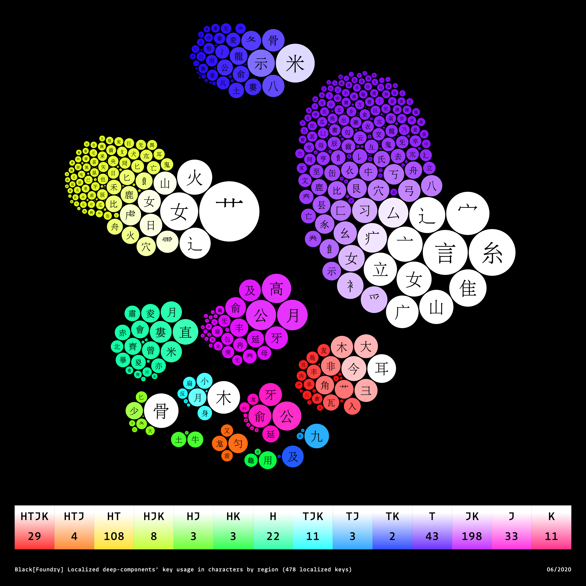

# Deep Components Levels 

## Deep-components' key usage in characters by level of complexity:

# Localized Deep-Components

## Localized Deep-components’ key usage in characters by region

## NOMENCLATURE

Localizing means Deep-components change in terms of their form and usage across the different CJK regions.

Each Deep Component (DC) that differs from its GB (China Mainland) form due to localization is marked as follows:

(DC_baseCharacter).(Type of Change)\_(Region)\*(Number)

Example:

	艹.V_htxx\*0

### Type of Change

We have categorised the DC localisation changes into 5 Types:

• All Change:
	**A**

This DC changes to another form across all characters in its region.

• Version Added: 
	**V**

This DC uses its original GB form when localized, but in addition to that, one or more versions have to be designed for use within its region. i.e. New versions are added on top of its GB form. The use of which version is character dependent.  Versions are bigger formal changes and are usually non-interpolatable with the GB form.

• Layer Add: 
	**L**

This DC has small variable change that is interpolatable with its GB form. A layer is added in the DC to achieve this. E.g. a longer or shorter leg or tail.

• Existing Version Switch: 
	**E**

This DC exists in GB but as a different version. 

• Compo Change: 
	**C**

Sometimes the character's composition changes for different(s) DC. This Character has one or more DCs that are replaced by a different DC in its region.

### Region

DCs that are localised are marked by their type of change, followed by the region in which the change occurs. Multiple regions are marked when regions share the same localisation change; 'h' for Hong Kong, 't' for Taiwan, 'j' for Japan, 'k' for Korea.

Examples:

	hxxx: Hong Kong
	xtxx: Taiwan
	xxjx: Japan
	xxxk: Korea
	htxx: Hong Kong + Taiwan
	xxjk: Japan + Korea
	hxjk: Hong Kong + Japan + Korea

### Number
Some DCs have more than one version, layer, or existing change. A number is added, starting from 0, to differentiate between changes. 

Examples:

	(DC).V_hxxx\*0
	(DC).V_hxxx\*1
	(DC).V_hxxx\*2
