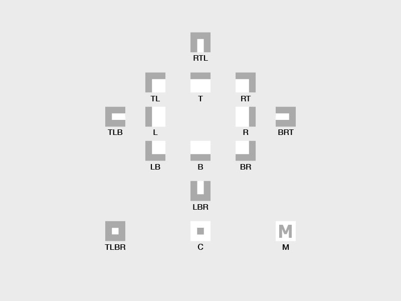

# Han Glyphs Composition Rules

**Component Naming Convention:**
1. Reference Unicode      (e.g. 5315)
2. Exact Unicode          (e.g. Y)
3. Position               (e.g. LB)
4. Version                (e.g. 03) -> This numbering is specific for each typeface design. It is defined in this convention but is design-dependent so, free to use by designers but not used in the data files.

Option:

5. Localisation           (e.g. THJK)

**Examples:**

U+800C can be made of 2 components named:
- 2EB5_N_B_00
- 4E06_Y_T_05

U+5EB5 can be made of 2 components named:
- 5944_Y_BR_02
- 5E7F_Y_TL_00

U+57C3 can be made of 2 components named:
- 571F_Y_L_00.J
- 77E3_Y_R_12

## Possible positions are:

T: Top

TL: Top Left

L:  Left

LB: Left Bottom

B: Bottom

BR: Bottom Right

R: Right

RT: Right Top

RTL: Right Top Left

TLB: Top Left Bottom

LBR: Left Bottom Right

BRT: Bottom Right Top

TLBR: Top Left Bottom Right

C: Center

M: Movable

